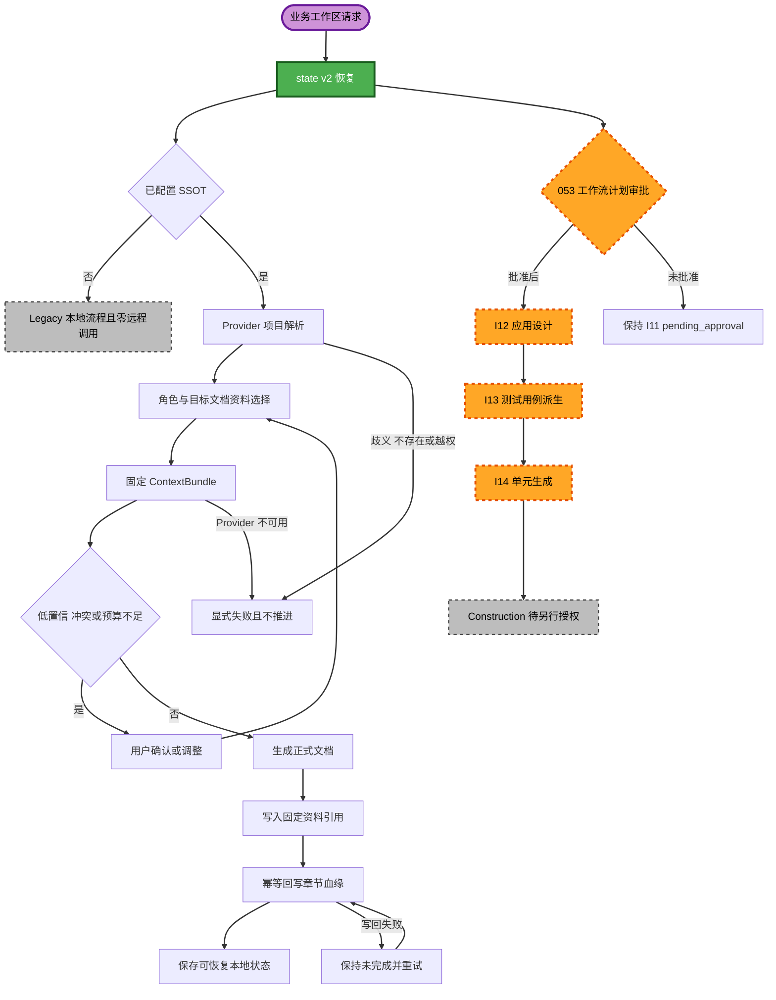

# I11 执行计划（AI-DLC Consumer）

## 计划状态

- **CR ID**：`CR-I5-SCOPE-001`
- **阶段**：CR4 B5 / I11 工作流规划
- **风险级别**：L4
- **状态**：`approved`
- **形成时间**：2026-07-19T10:31:16Z
- **状态模式版本**：2
- **授权前提**：SSOT 权威 `CR4-B5-I10-CROSS-VALIDATION-APPROVAL-052=A`
- **批准证据**：SSOT 权威 `CR4-B5-I11-WORKFLOW-PLAN-APPROVAL-053=A`
- **Provider 计划**：`../../../../../../../loeyae-ssot-server/docs/aidlc/modules/federated-ssot/inception/plans/execution-plan.md`；实际跨仓路径以双仓 `state.md` 为准
- **授权边界**：052 只授权关闭 SSOT I10 并生成双仓 I11 规划。本计划不启动 I12，不修改共享核心、Kiro Power、Claude Code/OpenCode 插件、Hook、MCP 或发布包，不证明 Consumer、Legacy 或三平台运行能力。

## 详细分析摘要

### 变更范围

- **变更类型**：存量 AI-DLC 的跨仓 Consumer 工作流规划。
- **主要变更**：规划从业务工作区 state v2 恢复、角色/目标文档意图、Provider 项目解析、资料选择和 ContextBundle，到正式研发文档生成、固定片段引用、章节血缘回写和失败恢复的端到端流程。
- **Consumer 边界**：AI-DLC 负责编排本地流程和角色化正式文档产出；不复制 SSOT 资料事实、机器 Schema、权限规则、解析/索引状态机或 Worker/数据库逻辑。
- **使用拓扑**：未来业务项目只在自身工作区维护一套 `docs/aidlc/state.md` 和过程产物；当前双仓只用于 SSOT 与 AI-DLC 两个产品的联合研发。
- **非范围**：业务项目双仓/双 state、平台绑定、state v3、Manifest/事件主链、远端 CR、跨项目共享和完整 Federated。

### 变更影响评估

| 影响领域 | 结论 | I11 规划结果 |
|----------|------|--------------|
| 用户可见变更 | 是 | 五类角色可按目标文档自动选择项目内资料，并看见来源、版本、片段、置信、降级和失败反馈 |
| 结构变更 | 是 | `loeyae-aidlc` Core 新增 Provider 消费边界，三平台继续共享 Core 语义并保持薄适配 |
| 数据模型变更 | 是 | RoleIntent、TargetDocument、MaterialSelection、ContextBundle、FragmentCitation、DocumentSection、LineageRecord 和 ReverseDocUpload 待 I12 冻结 |
| API/契约变更 | 是 | 消费八项 `candidate-v0` Provider 文档契约，字段与版本协商待 I12 |
| NFR 影响 | 是 | 平台中立、Secret 隔离、Legacy 零调用、失败不推进、幂等血缘、数据最小化和可恢复状态必须设计与验证 |
| 基础设施影响 | 否/间接 | 本仓不直连 Worker、数据库或索引；Provider 基础设施只通过契约状态影响 Consumer |

### 组件关系

| 组件 | 本地职责 | 上游或依赖 | 变更类型 | 优先级 |
|------|----------|------------|----------|--------|
| `loeyae-aidlc` Core | state v2 恢复、角色/目标文档意图、资料选择、上下文、正式文档、引用/血缘与逆向说明编排 | `ssot-api` 八项契约 | 重大 | 关键 |
| `kiro-power` | Kiro 调用、输入输出和状态呈现薄适配 | `loeyae-aidlc` Core | 次要 | 重要 |
| `claude-plugin` | Claude Code 调用、输入输出和状态呈现薄适配 | `loeyae-aidlc` Core | 次要 | 重要 |
| `opencode-plugin` | OpenCode 调用、输入输出和状态呈现薄适配 | `loeyae-aidlc` Core | 次要 | 重要 |
| `test-suite` | Core 契约、Legacy、三平台 conformance、故障与 E2E | Provider 与全部 Consumer | 重大 | 关键 |

本仓不直接依赖 `ssot-worker`、SSOT 数据库、对象存储或索引内部实现；三平台不得各自复制资料选择、失败处理或血缘业务规则。

### 风险评估

- **风险级别**：L4。原因是外部 Provider 契约、跨边界读写、项目与权限隔离、固定版本引用、幂等血缘、三平台一致性和 Legacy 零调用。
- **回滚复杂度**：困难；Consumer 只能回滚到 Provider 声明兼容的版本组合，不能通过客户端分叉规避 Core 兼容性。
- **测试复杂度**：复杂；必须覆盖项目歧义/越权、自动与显式资料选择、最新/旧版、低置信/预算、降级、Provider 不可用、写回失败、Legacy 和三平台接力。
- **系统基线**：AI-DLC `fac8fcff89e42f9ba09ee7f2bc08a45340b1c85e`、npm 1.20.0；SSOT `1431c6bde7c0f91243566d62e75bfac4a999fa4a`。本仓当前无 build/test script，Provider 无实现或机器 Schema。
- **外部证据要求**：后续运行证据必须含稳定运行标识、不可变提交、适用制品摘要、范围、结果、位置和时间；当前全部 Consumer 运行项均未验证。

## 端到端工作流

### 主旅程

1. **恢复本地状态**：从当前业务工作区读取 state v2、角色、目标文档和用户提示；平台只提供入口，不改变项目状态语义。
2. **判断接入模式**：若未配置 SSOT，进入 Legacy，保持 state v2 且远程调用数为 0；若已配置，携带短时访问上下文请求 Provider 解析唯一项目。
3. **项目与权限确认**：项目歧义、不存在或越权时稳定阻断，不按仓库名、目录或缓存猜测，不展示受保护资料。
4. **形成资料选择**：根据角色、目标文档和提示词自动检索；应用显式包含、排除和指定旧版。显式排除命中必须为 0，固定旧版不得提升到最新。
5. **消费 ContextBundle**：校验每个条目的资料、修订、片段、选择原因、讨论/结论、检索路径、降级和预算状态。
6. **人工确认边界**：低置信、来源冲突或预算不足时请求用户确认、缩小范围或调整选择；不得静默生成确定性结论。
7. **生成正式文档**：在业务工作区既有角色目录生成或修订正式文档；项目工作区/Git保存正文权威，AI-DLC 不把 SSOT 提升为正式文档正文权威。
8. **写入固定引用**：文档内容引用具体资料修订和片段，区分已确认资料、未确认讨论、显式结论和模型推断。
9. **回写章节血缘**：以正式文档版本和章节定位为边界，幂等回写 FragmentCitation、DocumentSection 和 LineageRecord；失败时保持未完成并重试。
10. **可选逆向说明上传**：逆向工程说明关联仓库路径、Git commit 和内容哈希上传为 SSOT 派生过程资料；不得反向覆盖代码事实。
11. **保存恢复状态**：只记录非敏感流程状态、固定引用和待恢复动作；不得把 Secret、短时令牌或完整资料正文写入 state 或普通日志。

### 审批与人工确认点

| 检查点 | Owner | 允许继续的条件 | 未通过行为 |
|--------|-------|----------------|------------|
| 在线模式启用 | 业务项目用户/Owner | SSOT 配置明确且项目可解析 | 保持 Legacy 与零远程调用 |
| 项目与访问上下文 | SSOT Provider | 唯一项目且访问获准 | 阻断在线流程，不猜测、不泄露 |
| ContextBundle 接受 | 当前用户 | 低置信、冲突、预算不足已确认或资料选择已调整 | 不生成确定性正式文档内容 |
| 正式文档批准 | 业务工作区既有 AI-DLC 门禁 | 对应需求、设计或计划审批通过 | 保留草案/待审状态；SSOT 不替代批准 |
| 章节血缘完成 | AI-DLC Core 与 SSOT Provider | 幂等写回成功，引用可定位 | 保持未完成并重试，不伪造同步成功 |
| I11 计划批准 | Boss / SSOT 权威门禁 053 | 双仓计划职责、契约、失败和阶段顺序获批 | I11 保持 `pending_approval`，不启动 I12 |

### 失败与边界分支

| 场景 | Consumer 行为 | 禁止行为 |
|------|---------------|----------|
| 项目歧义、不存在或越权 | 显示稳定拒绝并停止在线资料流程 | 猜测项目、回退其他项目、泄露名称/内容/片段 |
| 文件损坏、加密或不支持 | 展示 Provider 失败和恢复动作 | 将失败修订当作可用资料或假称当前指针已更新 |
| 并发修订冲突 | 刷新基准并请求用户重试 | 覆盖历史或静默重放写入 |
| 解析/索引失败 | 展示实际状态和 Provider 给出的可定位降级路径 | 把索引失败表达为资料不存在 |
| 未确认讨论 | 在正文和引用中保持未确认标识 | 伪装为定稿结论 |
| 固定旧版引用 | 保持指定修订和片段 | 自动漂移到最新修订 |
| 低置信、冲突或预算不足 | 请求确认、缩小范围或调整包含/排除 | 静默截断或生成确定性结论 |
| 引用/血缘写回失败 | 正式流程保持未完成，记录可恢复动作并幂等重试 | 标记已同步或创建重复逻辑血缘 |
| Provider 不可用 | 明确不可用，不推进依赖远端事实的状态 | 伪造读取、同步、批准或回写成功 |
| Legacy 未配置 SSOT | 使用现有本地流程、state v2、零远程调用 | 探测 Provider 或修改项目模式 |
| 平台切换 | 从同一工作区 state 和 Core 语义恢复 | 将平台写为项目属性或产生三份流程状态 |

## 八项契约追踪

| 契约 ID | Consumer 责任 | 工作流锚点 | I12/I13 后续证据 | 当前状态 |
|---------|---------------|------------|------------------|----------|
| `SSOT-PROJECT-001` | 提供已配置候选和短时上下文；稳定处理歧义/不存在/越权 | 步骤 2、3 | Consumer 映射；项目隔离与无泄露用例 | 待适配，运行未验证 |
| `SSOT-MATERIAL-001` | 默认最新、显式旧版、固定片段引用且不漂移 | 步骤 4、5、8 | 版本链、包含/排除和引用不漂移用例 | 待适配，运行未验证 |
| `SSOT-RETRIEVAL-001` | 传递项目内检索意图并展示实际路径、置信和降级 | 步骤 4、5 | 检索选择、降级和无跨项目结果用例 | 待适配，运行未验证 |
| `SSOT-CONTEXT-001` | 校验固定 ContextBundle、预算、状态和数据最小化 | 步骤 5、6 | 低置信、冲突、预算和排除用例 | 待适配，运行未验证 |
| `SSOT-REVERSE-DOC-001` | 关联路径、commit/hash 幂等上传逆向说明 | 步骤 10 | Git 关联、重试和代码权威边界用例 | 待适配，运行未验证 |
| `SSOT-LINEAGE-001` | 回写具体文档版本、章节、资料修订和片段；逻辑去重 | 步骤 8、9 | 写回失败、幂等、双向追踪用例 | 待适配，运行未验证 |
| `SSOT-INDEX-STATUS-001` | 只经 Provider 观察状态和恢复动作 | 步骤 4、5 | 状态展示、部分失败和不推进用例 | 待适配，运行未验证 |
| `SSOT-FAILURE-001` | 以稳定类别驱动阻断、提示、重试或显式降级 | 全流程 | 错误映射、不可用、限流和恢复用例 | 待适配，运行未验证 |

Provider 机器 Schema 只能由 SSOT 仓在 I12 建立；本仓 I12 只生成 Consumer 类型/适配、版本协商和错误映射设计，不复制 Provider 机器事实来源。

## 工作流可视化

### 文本替代

1. 业务工作区从唯一 state v2 恢复。
2. 未配置 SSOT 时走 Legacy 本地流程且零远程调用；已配置时由 Provider 解析唯一项目。
3. AI-DLC 按角色、目标文档、提示词、包含/排除和旧版要求消费固定 ContextBundle。
4. 低置信、冲突或预算不足需要用户确认；通过后生成正式文档、写入固定引用并幂等回写章节血缘。
5. Provider/权限/写回失败均显式阻断且不推进；平台切换始终复用同一 Core 语义和工作区状态。
6. 053 批准前停留 I11；批准后才允许进入 I12，随后依次执行 I13、I14。Construction 仅被规划，未获执行授权。

## 待执行阶段

### Inception

- [x] I1— I8 已按现行 CR 基线完成并批准。
- [x] AI-DLC I9/I10 不适用；本仓无产品 UI，不创建 UI Mock。
- [x] SSOT I10 已由权威 `CR4-B5-I10-CROSS-VALIDATION-APPROVAL-052=A` 关闭。
- [x] I11 工作流规划：SSOT 权威 `CR4-B5-I11-WORKFLOW-PLAN-APPROVAL-053=A` 已批准本计划并关闭 I11。
- [x] I12 应用设计：**已完成**。SSOT 权威 `CR4-B5-I12-APPLICATION-DESIGN-APPROVAL-055=A` 已批准 OpenAPI 3.1 `1.0.0-candidate.1`、双仓系统基线和 Provider/Consumer 设计，并于 2026-07-19T14:36:22Z 关闭 I12。
- [ ] I13 测试用例派生：**计划已启动，等待输入**。`test-case-derivation-plan.md` 已对齐 Provider A—J 参数化用例簇；SSOT 权威 `CR4-B5-I13-EVIDENCE-ANCHOR-DECISION-056=A` 已冻结登记方式，当前等待唯一 `CR4-B5-I13-EVIDENCE-ANCHOR-REGISTRATION-057`，证据锚点登记并复审前不创建用例正文。
- [ ] I14 单元生成：**必需，尚未启动**。为 `loeyae-aidlc`、`kiro-power`、`claude-plugin`、`opencode-plugin` 和 `test-suite` 生成实际工作单元。

### Construction 与 Operations

- [ ] C1 功能设计：条件必需，范围由 I12/I14 确认。
- [ ] C2/C3 NFR 需求与设计：条件必需，覆盖平台中立、Secret 隔离、错误恢复、可观测、性能和数据最小化。
- [ ] C4 基础设施设计：本仓当前不计划自建 Provider 基础设施；若 I12 发现新增运行组件，必须重新评估。
- [ ] C5 TDD 与两阶段审查：始终执行，但 I14 和 Construction 入场门禁前不得启动。
- [ ] C8 实际构建和测试：始终执行；当前无 build/test script，不得伪造通过。
- [ ] Operations：仅在 AI-DLC 产品发布目标经后续确认时规划；业务项目使用门禁不得绑定三平台发布矩阵。

## 模块更新策略

- **更新方式**：Provider-first 后 Consumer Core，再并行薄适配。
- **关键路径**：`ssot-api` 机器契约 → `loeyae-aidlc` Core → Kiro/Claude Code/OpenCode 薄适配 → `test-suite`。
- **可并行条件**：I12 冻结 Provider 候选后，Core 消费适配可与 Provider 非阻塞实现并行；三平台只能在 Core 接口稳定后并行；任何平台不得独立解释错误或资料选择规则。
- **协调点**：契约版本、项目解析、固定修订、ContextBundle、稳定失败、幂等血缘、state v2、Legacy 零调用和平台无关恢复。
- **测试检查点**：Provider Schema 校验 → Core 契约测试 → Legacy/故障测试 → 三平台 conformance → 与 Provider 的真实项目 E2E。
- **前端并行**：本仓无产品 UI；SSOT 静态 PC Mock 不构成本仓前端任务或 API 事实来源。

## 发布、回滚与停止条件

1. Consumer 只适配 Provider 已冻结并声明兼容的版本；不得超前读取未冻结字段、状态或错误码。
2. Core 是三平台唯一业务语义来源；任何平台适配失败不得通过在另一平台复制业务规则绕过。
3. Provider 不可用、项目/权限失败或固定修订缺失时，Consumer 不得推进依赖远端事实的 state；Legacy 只适用于未配置 SSOT，而不是在线失败的静默回退。
4. 血缘回写失败保持正式流程未完成并支持幂等重试；不得删除已生成文档、固定引用或审计，也不得伪造已同步。
5. 文档回滚以双仓 I11 计划为成对单位；运行时回滚以 Provider/Consumer 已验证版本组合为边界。
6. 若 I12 发现 state 迁移、未知直接 Consumer、平台特有业务规则、破坏性契约或无法证明的 Legacy 零调用/回滚条件，立即停止并提交 CR3 计划增量审批。
7. 任一运行项失败或未验证时不得声明 Consumer、Legacy、三平台或 E2E 能力完成。

## 里程碑与成功标准

- **里程碑**：053 已批准 I11 → 054 已冻结机器契约格式 → 055=A 已批准并关闭 I12 → 056 I13 证据锚点决策 → I13 用例审批 → I14 工作单元审批 → Construction 分单元实现与验证 → 条件 Operations。
- **工期边界**：当前无冻结机器契约、工作单元和测试入口，不作时间承诺；I14 后才能按实际单元估算。
- **I11 成功标准**：Consumer 主旅程、Legacy 分支、平台无关状态、八项契约消费、失败不推进、固定引用/血缘、模块顺序、并行条件和回滚边界均明确，并与 Provider 计划语义对称但职责不复制。
- **质量门禁**：Markdown/表格/Mermaid 与文本替代有效；SSOT 权威 055=A 已关闭 I12。I13 仅建立派生计划并处于 `pending_input`，唯一待回答门禁为 056；I14、Construction、`src/`、平台插件、Hook、MCP、package/config 均未启动或修改。
- **运行状态**：Provider Schema、Core 适配、项目/权限、资料选择、上下文、引用/血缘、逆向说明、Legacy 零调用、契约测试、三平台一致性、真实项目 E2E、构建、制品和发布全部未验证。
