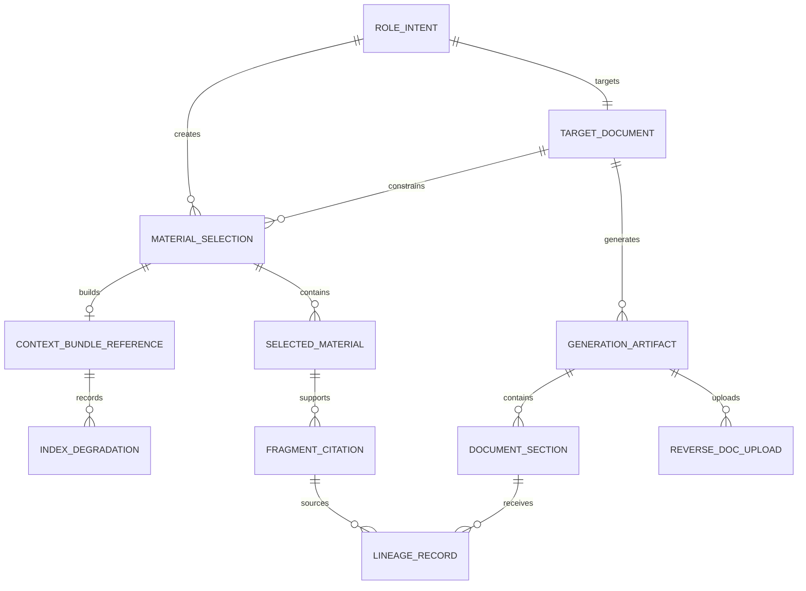
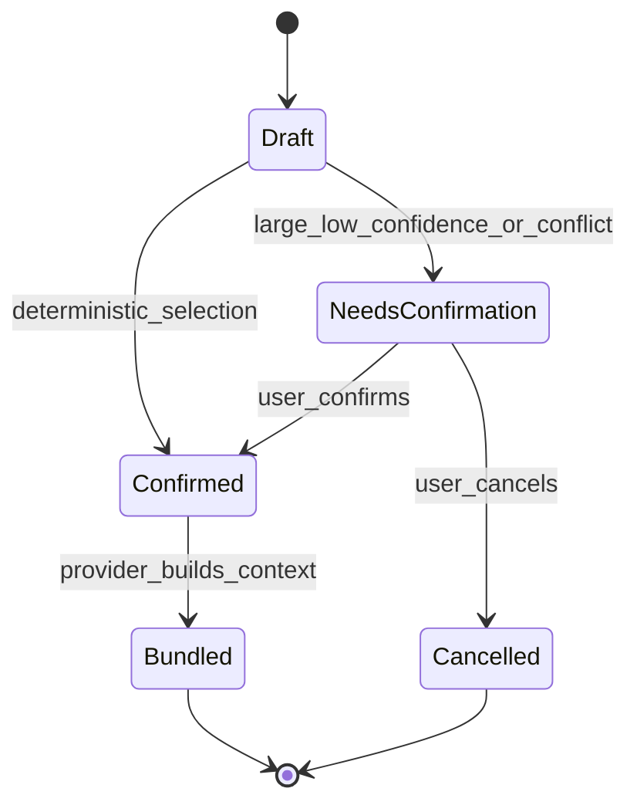
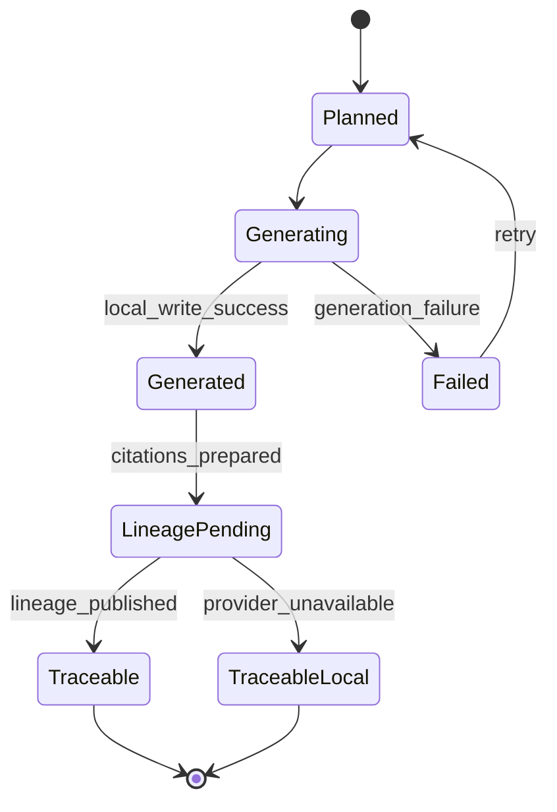
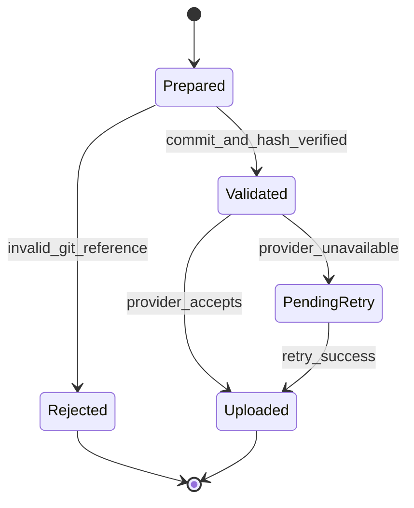

# federated-integration 需求阶段数据模型

- **现行基线**：CR-I5-SCOPE-001 / CR4 B2 候选
- **形成时间**：2026-07-18T05:27:44Z
- **状态**：Consumer 概念模型；字段级契约和持久化方式待 B3/I12
- **原则**：state v2 仍是业务工作区恢复事实；Consumer 只保存消费意图、选择、引用和本地文档产物，不复制 SSOT 权威资料

## 1. 对象分层与 Owner

| 层 | 对象 | Owner | 规则 |
|----|------|-------|------|
| 流程恢复 | 既有 state v2 | AI-DLC 业务工作区 | 不迁移为 v3；不读取插件自举 state |
| 消费意图 | RoleIntent、TargetDocument | AI-DLC | 由角色、目标文档、提示词和流程上下文形成 |
| Provider 绑定 | ProviderProjectBinding | AI-DLC 保存非敏感引用，SSOT 复核项目事实 | 不含平台类型、令牌或 Secret |
| 资料选择 | MaterialSelection、SelectedMaterial | AI-DLC | 固定资料修订；记录自动/包含/排除/旧版理由 |
| 上下文消费 | ContextBundleReference、IndexDegradation | SSOT 构建，AI-DLC 消费 | 记录 Provider bundle、预算和实际降级，不复制权威片段库 |
| 正式文档 | GenerationArtifact、DocumentSection | 项目工作区/Git | AI-DLC 生成；正文和批准版本由 Git或既有文档库权威管理 |
| 引用/血缘 | FragmentCitation、LineageRecord | AI-DLC 产生，SSOT 保存远端索引 | 固定修订/片段，不得漂移 |
| 逆向上传 | ReverseDocUpload | AI-DLC | 携带仓库路径、commit、内容哈希；代码事实仍归 Git |

## 2. 对象清单

| 对象 | 描述 | 关键属性 | 来源需求 |
|------|------|----------|----------|
| RoleIntent | 当前角色的资料消费意图 | role_intent_id、role、project_ref、prompt_hash、created_at | ADLC-FR-002 |
| TargetDocument | 目标正式文档定义 | target_document_id、type、path、authority、status | ADLC-FR-002 |
| ProviderProjectBinding | 已配置 SSOT 项目非敏感引用 | binding_id、provider_endpoint_ref、project_candidate、resolved_project_ref | ADLC-FR-003 |
| MaterialSelection | 一次资料选择决策 | selection_id、role_intent_id、target_document_id、status、reason | ADLC-FR-004 |
| SelectedMaterial | 选择中的固定资料修订 | selection_item_id、selection_id、material_id、revision_id、mode、reason | ADLC-FR-004 |
| ContextBundleReference | Provider 上下文包引用 | bundle_ref_id、selection_id、provider_bundle_id、budget、status | ADLC-FR-005 |
| IndexDegradation | 实际索引失败/降级信息 | degradation_id、bundle_ref_id、failed_route、fallback_route、reason | ADLC-FR-005 |
| GenerationArtifact | 一次正式文档生成产物 | generation_id、target_document_id、repository、path、commit、status | ADLC-FR-006 |
| DocumentSection | 生成文档章节定位 | section_id、generation_id、heading、anchor、content_hash、source_state | ADLC-FR-006 |
| FragmentCitation | 章节使用的固定片段引用 | citation_id、material_id、revision_id、fragment_id、locator、quote_hash | ADLC-FR-007 |
| LineageRecord | 引用到章节的血缘 | lineage_id、citation_id、section_id、created_at、publish_status | ADLC-FR-007 |
| ReverseDocUpload | 逆向说明上传请求 | upload_id、repository、commit、content_hash、provider_revision_ref、status | ADLC-FR-008 |

## 3. 对象关系图



### 文本替代

```text
state v2（外部既有恢复事实）
└─ RoleIntent ─ TargetDocument
   └─ MaterialSelection ─ SelectedMaterial
      └─ ContextBundleReference ─ IndexDegradation
         └─ GenerationArtifact ─ DocumentSection
            └─ FragmentCitation ─ LineageRecord
            └─ ReverseDocUpload ─ Git commit/content hash
```

## 4. 关键状态

### 4.1 MaterialSelection



规则：自动选择必须可解释；显式包含/排除和指定旧版覆盖自动选择。未确认冲突不得进入 `Bundled`。

### 4.2 GenerationArtifact



规则：Provider 不可用时可保留本地文档和待发布血缘，但不得标记远端已同步；state v2 的流程位置必须保持可恢复。

### 4.3 ReverseDocUpload



## 5. 核心不变量

1. RoleIntent 和 TargetDocument 必须绑定当前业务项目，不得包含客户端平台作为项目属性。
2. `SelectedMaterial` 必须固定 `material_id + revision_id`；只记录逻辑资料 ID 的选择无效。
3. 显式排除项不得出现在 ContextBundle 或引用中；指定旧版不得被默认最新版替换。
4. AI-DLC 不保存 SSOT 原件、完整片段库、向量或图关系的第二权威副本。
5. `FragmentCitation` 必须固定修订和片段；新修订不改变既有引用。
6. 每个有来源支撑的 `DocumentSection` 至少关联一个 `LineageRecord`；无来源内容必须标为模型推断。
7. GenerationArtifact 正文与批准版本由项目工作区/Git或既有文档库权威管理。
8. ReverseDocUpload 必须携带仓库、commit 和内容哈希；上传说明不改变代码事实。
9. Provider 失败、索引降级和血缘发布失败不得推进错误 state v2 状态或伪造成功。
10. 未配置 SSOT 时不得创建 ProviderProjectBinding、ContextBundleReference 或远程调用记录。

## 6. Provider/Consumer 对称映射

| Consumer 对象/动作 | Provider 权威对象/动作 | Consumer 责任 | 当前状态 |
|---------------------|-------------------------|---------------|----------|
| ProviderProjectBinding | Project/AccessContext | 提交候选并消费解析结果，不猜测项目 | 契约待 B3/I12 |
| SelectedMaterial | Material/MaterialRevision | 固定修订并记录选择理由 | 未实现 |
| ContextBundleReference | ContextBundle/MaterialFragment | 消费固定 bundle 和降级状态 | 未实现 |
| FragmentCitation | FragmentCitation/MaterialFragment | 输出实际引用，不生成虚假片段 | 未实现 |
| LineageRecord | DocumentReference/Section/Lineage | 关联本地章节并发布远端索引 | 未实现 |
| ReverseDocUpload | ReverseDocument/Revision/GitReference | 校验 commit/hash 后上传 | 未实现 |

## 7. 数据来源与生命周期

| 对象 | 创建来源 | 更新规则 | 权威/保留 |
|------|----------|----------|-----------|
| RoleIntent/TargetDocument | 用户角色、目标和流程上下文 | 新任务创建新记录 | AI-DLC 流程记录 |
| MaterialSelection | 自动检索 + 用户包含/排除/旧版 | 确认前可调整，确认后固定 | AI-DLC 选择事实；资料内容仍归 SSOT |
| ContextBundleReference | Provider 返回 | 不原地替换；重建产生新引用 | SSOT bundle 权威，AI-DLC 保存引用 |
| GenerationArtifact/Section | AI-DLC 本地生成 | 正式修改走 Git 版本 | 项目工作区/Git 权威 |
| Citation/Lineage | 实际生成使用情况 | 不漂移；新生成创建新记录 | AI-DLC 产生、SSOT 保存索引 |
| ReverseDocUpload | 逆向流程 + Git | 新 commit/内容创建新上传 | Git 管代码事实，SSOT 管说明修订 |

## 8. 历史模型处置

原 `SsotBinding`、`AidlcStateV3`、`ManifestSnapshot`、`ContextCache`、`ActiveChangeRequest`、`ImpactScope`、`SyncCursor`、`PendingSync`、`EvidenceReference`、`ContractPin`、`ClientCompatibility` 及 v2→v3 迁移、远端 CR、新鲜度状态机保留在 2026-07-17 历史 I5/I6 与审计中。它们被 `CR-I5-SCOPE-001` 取代，不得作为首期 active 对象。state v2 是既有恢复事实，不是本次新建的数据迁移对象。

## 9. 待 B3/I12/I13 冻结

- Provider API/MCP 操作、字段、错误码、鉴权和版本并存。
- 本地对象持久化位置、幂等键、待发布血缘和重试边界。
- 上下文预算、检索质量、引用完整性和三平台 conformance 阈值。
- ReverseDocUpload 大小、格式、敏感信息过滤和提交校验。
- Legacy 黄金样本与三平台可复现测试夹具。
