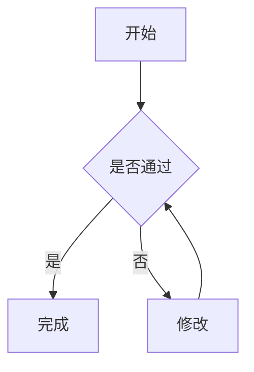
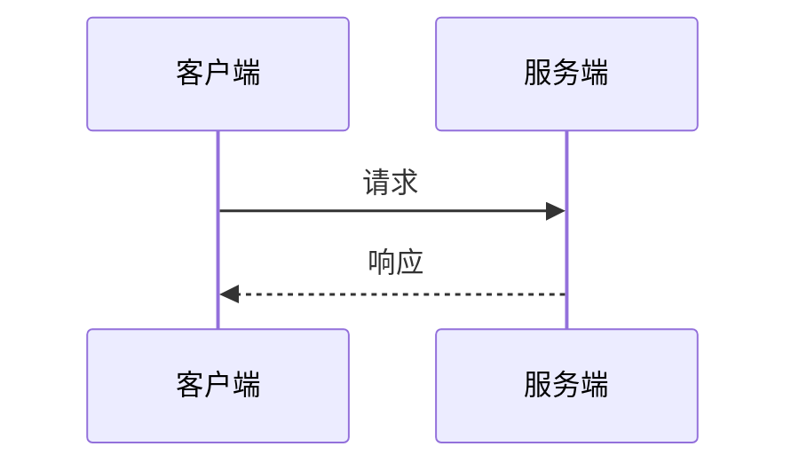
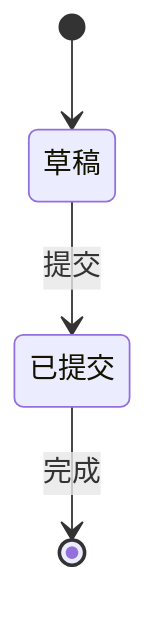
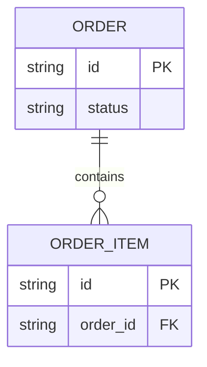
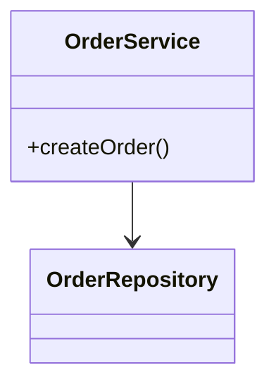

# Mermaid 可移植语法规则

## 适用范围

本文件定义 `common-mermaid-diagram-standards.md` 所要求的默认可移植语法子集。规则目标是降低 GitHub Markdown 与常见 IDE 渲染器之间的解析差异，不承诺所有 Mermaid 版本视觉完全一致。

## 通用规则

1. 代码块使用 `mermaid` 语言标识，首个有效语句声明图类型。
2. 标识符使用 ASCII 字母开头，仅包含字母、数字和下划线；展示文本与标识符分离。
3. 中文、空格或特殊字符出现在展示文本时使用双引号包裹。
4. 连线、样式和关系只引用标识符，不引用展示文本。
5. Mermaid 注释仅使用 `%%`；不得使用 `#`、`//` 或 Markdown 注释代替。
6. 不使用 Tab；缩进统一使用空格。
7. 避免将小写 `end` 用作 flowchart 节点 ID 或未加引号的标签。
8. 避免会与连线语法组合成特殊边的歧义标识符；连接符后的目标 ID 不以小写 `o` 或 `x` 开头。
9. 标签避免 `数字. 空格` 开头；需要编号时使用 `Step 1:` 或 `1-`。
10. 不依赖分号、省略方向、隐形连线或单行复合连接来压缩代码；以可审阅性优先。

## Flowchart

安全骨架：

规则：

- 使用 `flowchart TD` 或 `flowchart LR`，不混用多个顶层方向。
- 节点先以 ID 和标签明确声明，再用于复杂连接或样式。
- 子图使用 `subgraph group_id["展示名称"]`，结束关键字单独写 `end`。
- 子图内部方向仅作布局提示；存在跨子图连线时不得依赖其一定生效。
- 默认只使用 `-->` 和带文本的 `-->|"标签"|`；虚线或粗线仅在正文定义了明确语义时使用。
- 不使用隐形连线调整布局；布局不理想时拆图或简化关系。
- 默认不使用 HTML 标签、Markdown Strings、新版 `@{ shape: ... }`、click、动画或外部资源。

## Sequence Diagram

安全骨架：

规则：

- participant 标识符使用 ASCII；中文只放在 `as` 后的展示名和消息文本中。
- 消息必须明确方向；同步、异步和返回箭头的语义在同一文档中保持一致。
- 不使用脚本回调、外部链接或依赖特定主题的样式。

## State Diagram

安全骨架：

规则：

- 状态标识符使用 ASCII，并通过 `state "展示名" as StateId` 定义中文名称。
- 所有迁移必须有明确来源和目标；业务动作需要时写在冒号后。
- 起点和终点使用 `[*]`，不得用不存在的虚构状态补齐流程。

## ER Diagram

安全骨架：

规则：

- 实体名和字段名使用稳定 ASCII 标识符；业务中文名称在相邻表格中说明。
- 关系基数必须来自需求或数据模型证据，不得为图形完整性猜测。
- 字段只保留理解关系所需的关键项；完整字段和约束留在正文表格。

## Class Diagram

安全骨架：

规则：

- 类和成员标识使用代码或设计中的真实名称。
- 只表达已确认的继承、实现、组合或依赖，不从目录结构猜测关系。
- 复杂签名、泛型和注解放入正文，避免解析器版本差异。

## 静态检查清单

写入前至少检查：

- [ ] 代码围栏闭合且语言为 `mermaid`；
- [ ] 图类型和方向已显式声明；
- [ ] ID 唯一并符合 ASCII 命名规则；
- [ ] 展示标签中的中文、空格和特殊字符已安全包裹；
- [ ] 连线只引用 ID；
- [ ] 子图具有稳定 ID 且 `end` 配对；
- [ ] 注释使用 `%%`，无 `#` 伪注释；
- [ ] 无小写 `end` 歧义、`数字. 空格` 标签或连接符后的 `o/x` 歧义；
- [ ] 无默认禁用的 HTML、交互、新版专属或外部资源特性；
- [ ] 图表语义与相邻正文一致，未引入未批准内容。

静态检查不能替代 Mermaid parser。仓库未固定解析器版本时，必须明确记录“未执行真实语法解析”。

## 技术依据

- Mermaid 官方 Diagram Syntax 与各图类型文档；
- GitHub “Creating diagrams” 对 Mermaid fenced code block 和版本差异的说明；
- `axton-obsidian-visual-skills`（MIT）仅作为常见错误与可读性参考，未直接采用其相互冲突或平台专属规则。
