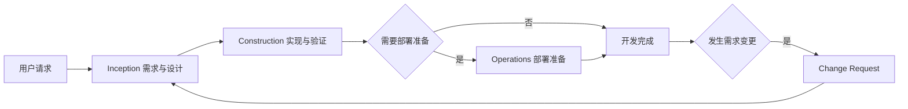

# AI-DLC 开发流程概览

**用途**：仅用于展示流程全貌，不定义规则。权威路由见 `core-workflow.md`，步骤详情见对应 steering。

## 生命周期边界

AI-DLC 覆盖完整开发流程：需求与验收定义、设计与拆分、TDD 实现、审查、实际构建测试，以及按需执行的部署准备。流程不覆盖部署后的生产运营。

## 文本流程

1. Inception：工作区检测 → 需求与交叉审查 → 用户故事与交叉审查 → 条件 UI Mock → 工作流规划 → 条件应用设计 → 条件测试用例派生 → 条件单元生成。
2. Construction：按单元设计 → TDD 实现 → 规格审查 → 质量审查 → 全局审查 → 实际构建和测试。
3. Operations（条件）：部署目标确认 → 目标相关配置 → 配置验证 → 部署/回滚说明。
4. Change Request：定位 → 影响评估 → 计划 → 逐层回写与实现 → 一致性验证。

## Mermaid 视图

## 自适应原则

复杂度仅决定文档深度和条件步骤，不削弱 TDD、两阶段审查、实际构建测试和证据要求。快速通道、精简流程、完整流程及各步骤条件以 `common-complexity-assessment.md` 和 `core-workflow.md` 为准。
