# AI-DLC 自适应工作流概览

**用途**：AI 模型和开发者理解完整工作流结构的技术参考。

**注意**：类似内容存在于 core-workflow.md（用户欢迎消息）和 README.md（文档）。这种重复是有意为之——每个文件服务于不同目的：
- **本文件**：带 Mermaid 图的详细技术参考，供 AI 模型上下文加载
- **core-workflow.md**：带 ASCII 图的用户欢迎消息
- **README.md**：人类可读的仓库文档

## 三阶段生命周期：
• **INCEPTION 阶段**：规划和架构（工作区检测 + 条件阶段 + 工作流规划）
• **CONSTRUCTION 阶段**：设计、实现、构建和测试（per-unit 设计 + 代码规划/生成 + 构建测试）
• **OPERATIONS 阶段**：CI/CD 配置和部署（容器化 + Jenkins Pipeline + K8s 部署清单）

## 复杂度驱动的执行路径：
• **简单任务**（≤3 文件，无新模型）→ **快速通道**：工作区检测 → 确认 → TDD 实现 → 验证 → 完成
• **中等任务**（4-10 文件，有业务逻辑）→ **精简流程**：工作区检测 → 需求分析 → 工作流规划 → [功能设计] → 代码生成 → 构建测试
• **复杂任务**（>10 文件，跨服务）→ **完整流程**：所有阶段按需执行

## 审批模式：
• **严格**：所有审批点等待确认（团队协作自动启用）
• **标准**（默认）：仅强制审批点（🔴）等待，默认审批点（🟡）自动通过
• **自主**：仅需求确认和架构决策等待

## 自适应工作流：
• **工作区检测**（必执行）→ **复杂度评估** → **逆向工程**（仅存量项目）→ **需求分析**（必执行，自适应深度）→ **条件阶段**（按需）→ **工作流规划**（必执行）→ **代码生成**（必执行，per-unit）→ **构建和测试**（必执行）→ **Operations**（条件）

## 工作原理：
• **AI 分析**你的请求、工作区和复杂度，确定需要哪些阶段
• **复杂度评估**决定执行路径：快速通道 / 精简流程 / 完整流程
• **这些阶段始终执行**：工作区检测、需求分析（自适应深度）、工作流规划、代码生成（per-unit）、构建和测试
• **所有其他阶段是条件性的**：逆向工程、用户故事、应用设计、单元生成、per-unit 设计阶段（功能设计、NFR 需求、NFR 设计、基础设施设计）、Operations
• **无固定顺序**：阶段按对你的具体任务有意义的顺序执行
• **手术式变更**：每一行改动追溯到用户请求，不"顺手改进"无关代码

## 团队角色：
• **回答问题**：在专用问题文件中使用 [回答]: 标签和字母选择（A、B、C、D、E）
• **团队协作**：审查和批准每个阶段后再继续
• **集体决策**：在需要时共同决定架构方案
• **重要**：这是团队协作——每个阶段都应让相关干系人参与

## AI-DLC 三阶段工作流：

```mermaid
flowchart TD
    Start(["用户请求"])
    
    subgraph INCEPTION["🔵 INCEPTION 阶段"]
        WD["工作区检测<br/><b>必执行</b>"]
        RE["逆向工程<br/><b>条件</b>"]
        RA["需求分析<br/><b>必执行</b>"]
        Stories["用户故事<br/><b>条件</b>"]
        WP["工作流规划<br/><b>必执行</b>"]
        AppDesign["应用设计<br/><b>条件</b>"]
        UnitsG["单元生成<br/><b>条件</b>"]
    end
    
    subgraph CONSTRUCTION["🟢 CONSTRUCTION 阶段"]
        FD["功能设计<br/><b>条件</b>"]
        NFRA["NFR 需求<br/><b>条件</b>"]
        NFRD["NFR 设计<br/><b>条件</b>"]
        ID["基础设施设计<br/><b>条件</b>"]
        CG["代码生成<br/><b>必执行</b>"]
        BT["构建和测试<br/><b>必执行</b>"]
    end

    subgraph OPERATIONS["🟠 OPERATIONS 阶段"]
        OPS["CI/CD 配置生成<br/><b>条件</b>"]
    end
    
    Start --> WD
    WD -.-> RE
    WD --> RA
    RE --> RA
    
    RA -.-> Stories
    RA --> WP
    Stories --> WP
    
    WP -.-> AppDesign
    WP -.-> UnitsG
    AppDesign -.-> UnitsG
    UnitsG --> FD
    FD -.-> NFRA
    NFRA -.-> NFRD
    NFRD -.-> ID
    
    WP --> CG
    FD --> CG
    NFRA --> CG
    NFRD --> CG
    ID --> CG
    CG -.->|下一单元| FD
    CG --> BT
    BT -.-> OPS
    OPS --> End(["完成"])
    BT --> End
    
    style WD fill:#4CAF50,stroke:#1B5E20,stroke-width:3px,color:#fff
    style RA fill:#4CAF50,stroke:#1B5E20,stroke-width:3px,color:#fff
    style WP fill:#4CAF50,stroke:#1B5E20,stroke-width:3px,color:#fff
    style CG fill:#4CAF50,stroke:#1B5E20,stroke-width:3px,color:#fff
    style BT fill:#4CAF50,stroke:#1B5E20,stroke-width:3px,color:#fff
    style RE fill:#FFA726,stroke:#E65100,stroke-width:3px,stroke-dasharray: 5 5,color:#000
    style Stories fill:#FFA726,stroke:#E65100,stroke-width:3px,stroke-dasharray: 5 5,color:#000
    style AppDesign fill:#FFA726,stroke:#E65100,stroke-width:3px,stroke-dasharray: 5 5,color:#000
    style UnitsG fill:#FFA726,stroke:#E65100,stroke-width:3px,stroke-dasharray: 5 5,color:#000
    style FD fill:#FFA726,stroke:#E65100,stroke-width:3px,stroke-dasharray: 5 5,color:#000
    style NFRA fill:#FFA726,stroke:#E65100,stroke-width:3px,stroke-dasharray: 5 5,color:#000
    style NFRD fill:#FFA726,stroke:#E65100,stroke-width:3px,stroke-dasharray: 5 5,color:#000
    style ID fill:#FFA726,stroke:#E65100,stroke-width:3px,stroke-dasharray: 5 5,color:#000
    style OPS fill:#FFA726,stroke:#E65100,stroke-width:3px,stroke-dasharray: 5 5,color:#000
    style INCEPTION fill:#BBDEFB,stroke:#1565C0,stroke-width:3px,color:#000
    style CONSTRUCTION fill:#C8E6C9,stroke:#2E7D32,stroke-width:3px,color:#000
    style OPERATIONS fill:#FFE0B2,stroke:#E65100,stroke-width:3px,color:#000
    style Start fill:#CE93D8,stroke:#6A1B9A,stroke-width:3px,color:#000
    style End fill:#CE93D8,stroke:#6A1B9A,stroke-width:3px,color:#000
    
    linkStyle default stroke:#333,stroke-width:2px
```

**阶段描述：**

**🔵 INCEPTION 阶段** - 规划与架构
- 工作区检测：分析工作区状态和项目类型（必执行）
- 逆向工程：分析现有代码库（条件 - 仅存量项目）
- 需求分析：收集和验证需求（必执行 - 自适应深度）
- 用户故事：创建用户故事和角色（条件）
- 工作流规划：创建执行计划（必执行）
- 应用设计：高层组件识别和服务层设计（条件）
- 单元生成：分解为工作单元（条件）

**🟢 CONSTRUCTION 阶段** - 设计、实现、构建和测试
- 功能设计：每个单元的详细业务逻辑设计（条件，per-unit）
- NFR 需求：确定 NFR 并选择技术栈（条件，per-unit）
- NFR 设计：融入 NFR 模式和逻辑组件（条件，per-unit）
- 基础设施设计：映射到实际基础设施服务（条件，per-unit）
- 代码生成：生成代码，含规划和生成两部分（必执行，per-unit）
- 构建和测试：构建所有单元并执行全面测试（必执行）

**🟠 OPERATIONS 阶段** - CI/CD 配置和部署
- Operations：生成 CI/CD 配置文件和部署文档（条件 — 需要部署的项目）
  - Dockerfile：容器化配置（根据项目类型自动选择基础镜像）
  - Jenkinsfile：CI/CD Pipeline（build → push → deploy 全链路）
  - K8s 部署清单：Service + Deployment + Ingress（test/prod 双环境）
  - 部署文档：流程说明 + 手动操作 + 故障排除

**核心原则：**
- 阶段仅在有价值时执行
- 每个阶段独立评估
- INCEPTION 聚焦"做什么"和"为什么"
- CONSTRUCTION 聚焦"怎么做"加"构建和测试"
- OPERATIONS 聚焦"如何运行和维护"
- 简单变更可跳过条件性 INCEPTION 阶段
- 复杂变更获得完整 INCEPTION、CONSTRUCTION 和 OPERATIONS 处理
