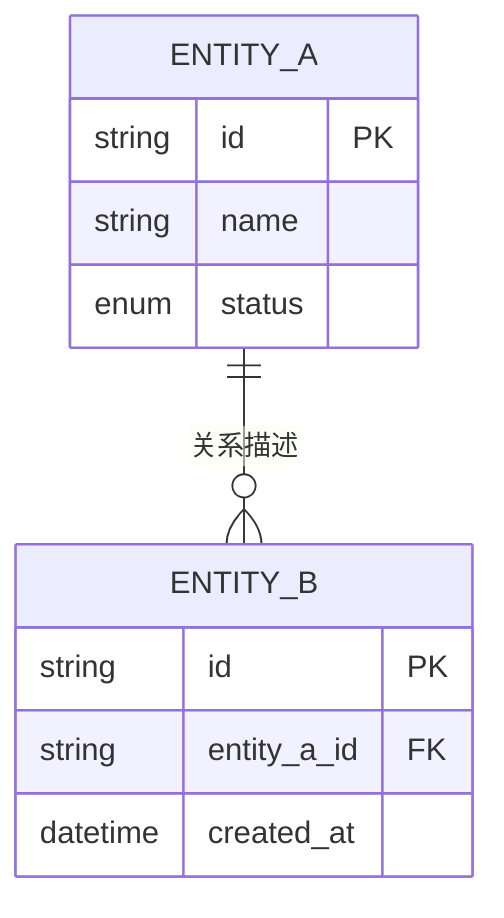
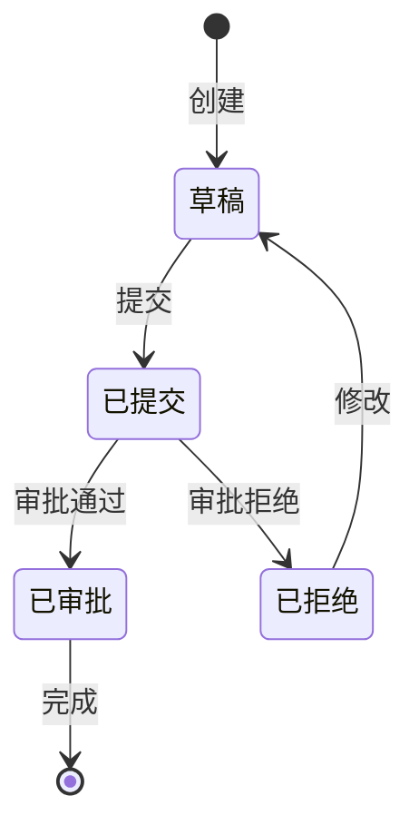

# 需求阶段数据建模（仅全面深度）

**加载条件**：仅在需求分析确定为"全面深度"时加载本文件。

**目的**：在需求阶段就建立数据模型的初步理解，为后续应用设计提供基础。

---

## 实体识别

从需求中提取所有数据实体：

```markdown
## 数据实体清单

| 实体 | 描述 | 关键属性 | 来源需求 |
|------|------|----------|----------|
| [实体名] | [一句话描述] | [核心字段] | REQ-XXX |
```

---

## 实体关系图（ER Diagram）

使用 Mermaid erDiagram 语法：



**关系类型**：

| 符号 | 含义 |
|------|------|
| `\|\|--o{` | 一对多 |
| `\|\|--\|\|` | 一对一 |
| `}o--o{` | 多对多 |
| `\|\|--o\|` | 一对零或一 |

---

## 状态图（关键实体）

对有生命周期的实体，使用 Mermaid stateDiagram-v2：



**状态图要素**：
- `[*]` — 起始/终止节点
- `状态名` — 实体状态
- `-->` — 状态转换
- `: 动作` — 触发转换的动作

---

## 执行步骤

1. 从需求中识别所有实体
2. 绘制 ER 图（实体 + 关系 + 关键属性）
3. 为有状态流转的实体绘制状态图
4. 向用户确认数据模型

**产出**：数据模型写入 `docs/aidlc/inception/requirements/data-model.md`

---

## 数据模型检查清单

- [ ] 所有需求中提到的实体都已识别
- [ ] 主键已定义
- [ ] 外键和关系已映射
- [ ] 关键属性类型已指定
- [ ] 有生命周期的实体有状态图
- [ ] 用户已确认数据模型
