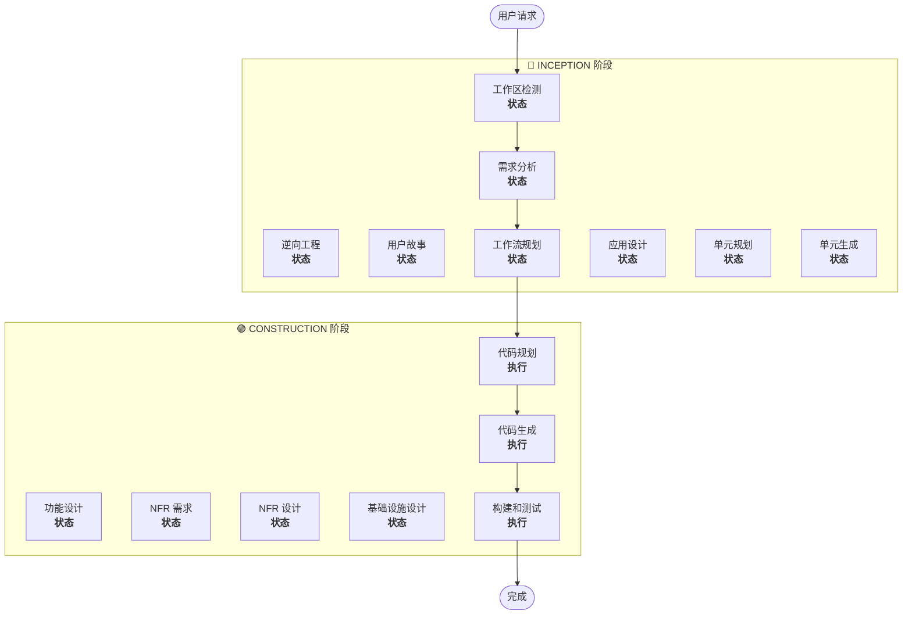

# 工作流规划

**目的**：确定需要执行的阶段，创建全面的执行计划

**始终执行**：在理解需求和范围后，此阶段始终运行

## 步骤 1：加载所有先前上下文

### 1.1 加载逆向工程产物（如为存量项目）
- architecture.md
- component-inventory.md
- technology-stack.md
- dependencies.md
- frontend-architecture.md（如存在）

### 1.2 加载需求分析
- requirements.md（包含意图分析）
- requirement-verification-questions.md（含答案）

### 1.3 加载用户故事（如已执行）
- stories.md
- personas.md

## 步骤 2：详细范围和影响分析

**现在我们有了完整上下文（需求 + 故事），执行详细分析：**

### 2.1 变更范围检测（仅存量项目）

**如果是存量项目**，分析变更范围：

#### 架构变更
- **单组件变更** vs **架构变更**
- **基础设施变更** vs **应用变更**
- **部署模型变更**（Lambda→容器, EC2→Serverless 等）

#### 关联组件识别
对于变更，识别：
- 需要更新的**基础设施代码**
- 需要变更的 **CDK 栈**
- **API 网关**配置
- **负载均衡器**需求
- **网络**变更需求
- **监控/日志**适配

#### 跨包影响
- 需要更新的 **CDK 基础设施**包
- 需要版本更新的**共享模型**
- 需要端点变更的**客户端库**
- 需要新测试场景的**测试包**

### 2.2 变更影响评估

#### 影响领域
1. **用户可见变更**：是否影响用户体验？
2. **结构变更**：是否改变系统架构？
3. **数据模型变更**：是否影响数据库 schema 或数据结构？
4. **API 变更**：是否影响接口或契约？
5. **NFR 影响**：是否影响性能、安全或可扩展性？

#### 应用层影响（如适用）
- **代码变更**：新入口点、适配器、配置
- **依赖**：新库、框架变更
- **配置**：环境变量、配置文件
- **测试**：单元测试、集成测试

#### 基础设施层影响（如适用）
- **部署模型**：Lambda→ECS, EC2→Fargate 等
- **网络**：VPC、安全组、负载均衡器
- **存储**：持久卷、共享存储
- **扩展**：自动扩展策略、容量规划

### 2.3 组件关系映射（仅存量项目）

**如果是存量项目**，创建组件依赖图：

```markdown
## 组件关系
- **主要组件**：[被变更的包]
- **基础设施组件**：[CDK/Terraform 包]
- **共享组件**：[模型、工具、客户端]
- **依赖组件**：[调用此组件的服务]
- **支撑组件**：[监控、日志、部署]
```

对每个关联组件：
- **变更类型**：重大、次要、仅配置
- **变更原因**：直接依赖、部署模型、网络
- **变更优先级**：关键、重要、可选

### 2.4 风险评估

评估风险级别：
1. **低**：隔离变更，易回滚，充分理解
2. **中**：多组件，中等回滚难度，部分未知
3. **高**：系统级影响，复杂回滚，显著未知
4. **关键**：生产关键，困难回滚，高不确定性

## 步骤 3：阶段确定

### 3.1 用户故事 — 已执行还是跳过？
**已执行**：进入下一个确定
**未执行 — 执行条件**：
- 多用户角色
- 用户体验影响
- 需要验收标准
- 需要团队协作

**跳过条件**：
- 内部重构
- 有明确复现步骤的 Bug 修复
- 技术债务减少
- 基础设施变更

### 3.2 应用设计 — 执行条件：
- 需要新组件或服务
- 需要定义组件方法和业务规则
- 需要服务层设计
- 需要澄清组件依赖

**跳过条件**：
- 在现有组件边界内的变更
- 无新组件或方法
- 纯实现变更

### 3.3 设计（单元规划/生成）— 执行条件：
- 新数据模型或 schema
- API 变更或新端点
- 复杂算法或业务逻辑
- 状态管理变更
- 多个包需要变更
- 需要基础设施即代码更新

**跳过条件**：
- 简单逻辑变更
- 仅 UI 变更
- 配置更新
- 直接的实现

### 3.4 NFR 实现 — 执行条件：
- 性能需求
- 安全考虑
- 可扩展性关注
- 需要监控/可观测性

**跳过条件**：
- 现有 NFR 设置足够
- 无新 NFR 需求
- 简单变更无 NFR 影响

## 步骤 4：注意自适应详细度

**参见 [depth-levels.md](common-depth-levels.md) 了解自适应深度说明**

对每个将执行的阶段：
- 所有定义的产物将被创建
- 产物内的详细程度根据问题复杂度自适应
- 模型根据问题特征确定适当的详细程度

## 步骤 5：多模块协调分析（仅存量项目）

**如果存量项目有多个模块/包**，分析依赖并确定最优更新策略：

### 5.1 分析模块依赖
- 检查构建系统依赖和依赖清单
- 识别构建时 vs 运行时依赖
- 映射模块间的 API 契约和共享接口

### 5.2 确定更新策略
基于依赖分析，决定：
- **更新顺序**：哪些模块因依赖必须先更新
- **并行机会**：哪些模块可以同时更新
- **协调需求**：版本兼容性、API 契约、部署顺序
- **测试策略**：按模块 vs 集成测试方式
- **回滚策略**：中途失败的恢复计划

### 5.3 前后端并行开发规划

**如果项目包含前端和后端**，规划并行开发策略：

#### API 契约优先
- 先定义前后端接口契约（API 路径、请求/响应格式、状态码）
- 前端可基于契约使用 Mock 数据并行开发
- 后端按契约实现接口

#### 并行开发顺序
```
后端：数据模型 → Service → Controller → 接口测试
前端：类型定义 → API 接口 → Store → 页面组件 → 联调
         ↑                                    ↓
         └──────── API 契约 ────────────────────┘
```

#### 联调检查点
- 后端接口完成后进行前后端联调
- 验证接口契约一致性
- 处理边界情况和错误场景

### 5.4 记录协调计划
```markdown
## 模块更新策略
- **更新方式**：[顺序/并行/混合]
- **关键路径**：[阻塞其他更新的模块]
- **协调点**：[共享 API、基础设施、数据契约]
- **测试检查点**：[何时验证集成]
- **前后端并行**：[是否采用并行开发，API 契约定义时机]
```

对每个受影响的模块识别：
- **更新优先级**：必须先更新 vs 可以后更新
- **依赖约束**：依赖什么，什么依赖它
- **变更范围**：重大（破坏性）、次要（兼容）、补丁（修复）

## 步骤 6：生成工作流可视化

创建 Mermaid 流程图展示：
- 所有阶段按顺序排列
- 每个条件阶段的执行或跳过决策
- 每个阶段状态的适当样式

**样式规则**（添加在流程图之后）：
```
style WD fill:#4CAF50,stroke:#1B5E20,stroke-width:3px,color:#fff
style CP fill:#4CAF50,stroke:#1B5E20,stroke-width:3px,color:#fff
style CG fill:#4CAF50,stroke:#1B5E20,stroke-width:3px,color:#fff
style BT fill:#4CAF50,stroke:#1B5E20,stroke-width:3px,color:#fff
style US fill:#BDBDBD,stroke:#424242,stroke-width:2px,stroke-dasharray: 5 5,color:#000
style Start fill:#CE93D8,stroke:#6A1B9A,stroke-width:3px,color:#000
style End fill:#CE93D8,stroke:#6A1B9A,stroke-width:3px,color:#000

linkStyle default stroke:#333,stroke-width:2px
```

**样式指南**：
- 已完成/始终执行：`fill:#4CAF50,stroke:#1B5E20,stroke-width:3px,color:#fff`（Material 绿色白字）
- 条件执行：`fill:#FFA726,stroke:#E65100,stroke-width:3px,stroke-dasharray: 5 5,color:#000`（Material 橙色黑字）
- 条件跳过：`fill:#BDBDBD,stroke:#424242,stroke-width:2px,stroke-dasharray: 5 5,color:#000`（Material 灰色黑字）
- 开始/结束：`fill:#CE93D8,stroke:#6A1B9A,stroke-width:3px,color:#000`（Material 紫色黑字）
- 阶段容器：使用较浅的 Material 颜色（INCEPTION: #BBDEFB, CONSTRUCTION: #C8E6C9）

## 步骤 7：创建执行计划文档

创建 `docs/aidlc/inception/plans/execution-plan.md`：

```markdown
# 执行计划

## 详细分析摘要

### 变更范围（仅存量项目）
- **变更类型**：[单组件/架构级/基础设施]
- **主要变更**：[描述]
- **关联组件**：[列表]

### 变更影响评估
- **用户可见变更**：[是/否 - 描述]
- **结构变更**：[是/否 - 描述]
- **数据模型变更**：[是/否 - 描述]
- **API 变更**：[是/否 - 描述]
- **NFR 影响**：[是/否 - 描述]

### 组件关系（仅存量项目）
[组件依赖图]

### 风险评估
- **风险级别**：[低/中/高/关键]
- **回滚复杂度**：[简单/中等/困难]
- **测试复杂度**：[简单/中等/复杂]

## 工作流可视化



**注意**：将"状态"占位符替换为实际阶段状态（已完成/跳过/执行）并应用相应样式

## 待执行阶段

### 🔵 INCEPTION 阶段
- [x] 工作区检测（已完成）
- [x] 逆向工程（已完成/已跳过）
- [x] 需求分析（已完成）
- [x] 用户故事（已完成/已跳过）
- [x] 执行计划（进行中）
- [ ] 应用设计 - [执行/跳过]
  - **理由**：[执行或跳过的原因]
- [ ] 单元规划 - [执行/跳过]
  - **理由**：[执行或跳过的原因]
- [ ] 单元生成 - [执行/跳过]
  - **理由**：[执行或跳过的原因]

### 🟢 CONSTRUCTION 阶段
- [ ] 功能设计 - [执行/跳过]
  - **理由**：[执行或跳过的原因]
- [ ] NFR 需求 - [执行/跳过]
  - **理由**：[执行或跳过的原因]
- [ ] NFR 设计 - [执行/跳过]
  - **理由**：[执行或跳过的原因]
- [ ] 基础设施设计 - [执行/跳过]
  - **理由**：[执行或跳过的原因]
- [ ] 代码规划 - 执行（始终）
  - **理由**：需要实现方案
- [ ] 代码生成 - 执行（始终）
  - **理由**：需要代码实现
- [ ] 构建和测试 - 执行（始终）
  - **理由**：需要构建、测试和验证

## 包变更顺序（仅存量项目）
[如适用，列出包更新顺序及依赖]

## 前后端并行计划（如适用）
- **API 契约定义时机**：[在哪个阶段完成]
- **前端可开始时机**：[API 契约确定后]
- **联调检查点**：[后端接口完成后]

## 预估时间线
- **总阶段数**：[数量]
- **预估时长**：[时间估计]

## 成功标准
- **主要目标**：[主要目的]
- **关键交付物**：[列表]
- **质量门禁**：[列表]

[如为存量项目]
- **集成测试**：所有组件协同工作
- **运维就绪**：监控、日志、告警正常工作
```

## 步骤 8：初始化状态跟踪

更新 `docs/aidlc/state.md`：

```markdown
# AI-DLC 状态跟踪

## 项目信息
- **项目类型**：[全新项目/存量项目]
- **开始日期**：[ISO 时间戳]
- **当前步骤**：INCEPTION - 工作流规划

## 执行计划摘要
- **总阶段数**：[数量]
- **待执行阶段**：[列表]
- **跳过阶段**：[列表及原因]

## 阶段进度

### 🔵 INCEPTION 阶段
- [x] 工作区检测
- [x] 逆向工程（如适用）
- [x] 需求分析
- [x] 用户故事（如适用）
- [x] 工作流规划
- [ ] 应用设计 - [执行/跳过]
- [ ] 单元规划 - [执行/跳过]
- [ ] 单元生成 - [执行/跳过]

### 🟢 CONSTRUCTION 阶段
- [ ] 功能设计 - [执行/跳过]
- [ ] NFR 需求 - [执行/跳过]
- [ ] NFR 设计 - [执行/跳过]
- [ ] 基础设施设计 - [执行/跳过]
- [ ] 代码规划 - 执行
- [ ] 代码生成 - 执行
- [ ] 构建和测试 - 执行

## 当前状态
- **生命周期阶段**：INCEPTION
- **当前步骤**：工作流规划完成
- **下一步骤**：[下一个待执行步骤]
- **状态**：准备继续
```

## 步骤 9：向用户展示计划

```markdown
# 📋 工作流规划完成

基于以下内容创建了全面的执行计划：
- 你的请求：[摘要]
- 现有系统：[摘要（如为存量项目）]
- 需求：[摘要（如已执行）]
- 用户故事：[摘要（如已执行）]

**详细分析**：
- 风险级别：[级别]
- 影响：[关键影响摘要]
- 受影响组件：[列表]

**推荐执行计划**：

推荐执行 [X] 个阶段：

🔵 **INCEPTION 阶段：**
1. [阶段名称] - *理由：* [执行原因]
2. [阶段名称] - *理由：* [执行原因]
...

🟢 **CONSTRUCTION 阶段：**
3. [阶段名称] - *理由：* [执行原因]
4. [阶段名称] - *理由：* [执行原因]
...

推荐跳过 [Y] 个阶段：

🔵 **INCEPTION 阶段：**
1. [阶段名称] - *理由：* [跳过原因]
...

🟢 **CONSTRUCTION 阶段：**
2. [阶段名称] - *理由：* [跳过原因]
...

[如为存量项目且有多个包]
**推荐包更新顺序**：
1. [包] - [原因]
2. [包] - [原因]
...

**预估时间线**：[时长]

> **📋 <u>**需要审查：**</u>**
> 请检查执行计划：`docs/aidlc/inception/plans/execution-plan.md`

> **🚀 <u>**下一步？**</u>**
>
> **你可以：**
>
> 🔧 **请求修改** - 要求修改执行计划
> [如有阶段被跳过：]
> 📝 **添加跳过的阶段** - 选择包含当前标记为跳过的阶段
> ✅ **确认并继续** - 确认计划，进入**[下一阶段名称]**
```

## 步骤 10：处理用户回复

- **如果确认**：进入执行计划中的下一阶段
- **如果请求修改**：更新执行计划并重新确认
- **如果用户要求强制包含/排除阶段**：相应更新计划

## 步骤 11：记录交互

在 `docs/aidlc/audit.md` 中记录：

```markdown
## 工作流规划 - 审批
**时间戳**：[ISO 时间戳]
**AI 提示**："准备按此计划继续？"
**用户回复**："[用户的完整原始回复]"
**状态**：[已确认/请求修改]
**上下文**：创建了包含 [X] 个待执行阶段的工作流计划

---
```
